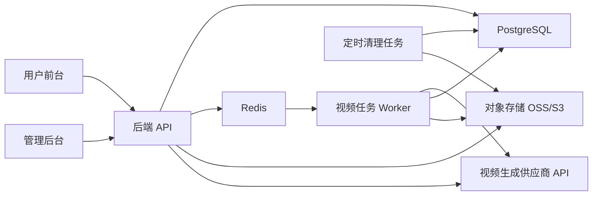

# 后端架构、数据库选型与兑换积分方案

调研日期：2026-06-28

## 1. 结论先行

推荐技术栈：

- 主数据库：PostgreSQL
- 后端：Node.js + TypeScript，推荐 NestJS 或 Fastify
- ORM：Prisma 优先，必要位置使用原生 SQL
- 队列：Redis + BullMQ
- 文件存储：S3 兼容对象存储，国内推荐阿里云 OSS 或腾讯云 COS
- 部署：Docker Compose 起步；生产环境推荐“应用容器 + 托管 PostgreSQL + 托管 Redis + 对象存储”

为什么推荐 PostgreSQL：

- 兑换码兑换、积分扣减、视频任务扣费都需要强事务。
- PostgreSQL 支持唯一约束、行级锁、事务隔离、`SELECT ... FOR UPDATE` 等能力，适合防止兑换码被并发重复兑换。
- 后续还会有管理员后台查询、视频记录、积分流水、JSON 参数配置，PostgreSQL 对结构化数据和 JSON 数据都比较友好。

不推荐把兑换码和积分放在 Redis：

- Redis 适合队列、限流、缓存，不适合作为积分余额和兑换码最终账本。
- 积分是财务类数据，应以数据库事务和不可变流水为准。

## 2. 关键调研依据

官方资料要点：

- PostgreSQL 文档说明事务隔离、行锁、唯一约束等能力，可用于兑换码一致性校验和并发控制。
- Prisma 官方文档支持事务 API，也支持设置事务隔离级别；复杂事务可以用 interactive transaction。
- Node.js `crypto` 提供安全随机数与哈希能力，适合生成不可预测兑换码并存储哈希。
- OWASP 建议密码不能明文保存，应使用 Argon2id、scrypt、bcrypt、PBKDF2 等慢哈希算法。
- BullMQ 是基于 Redis 的 Node.js 队列方案，适合视频生成这种异步任务。
- S3/OSS 支持对象生命周期规则，可以配合服务端定时任务实现“视频只保留 3 天”。
- 如果部署在中国大陆公网域名，阿里云等云厂商要求完成 ICP 备案流程。

参考来源：

- PostgreSQL 事务隔离：https://www.postgresql.org/docs/current/transaction-iso.html
- PostgreSQL 显式锁：https://www.postgresql.org/docs/current/explicit-locking.html
- PostgreSQL 约束：https://www.postgresql.org/docs/current/ddl-constraints.html
- PostgreSQL UUID：https://www.postgresql.org/docs/current/datatype-uuid.html
- Prisma 事务：https://www.prisma.io/docs/orm/prisma-client/queries/transactions
- Node.js Crypto：https://nodejs.org/api/crypto.html
- OWASP Password Storage：https://cheatsheetseries.owasp.org/cheatsheets/Password_Storage_Cheat_Sheet.html
- OWASP Authentication：https://cheatsheetseries.owasp.org/cheatsheets/Authentication_Cheat_Sheet.html
- BullMQ：https://docs.bullmq.io/
- AWS S3 Lifecycle：https://docs.aws.amazon.com/AmazonS3/latest/userguide/object-lifecycle-mgmt.html
- 阿里云 OSS 生命周期规则：https://www.alibabacloud.com/help/en/oss/user-guide/lifecycle-rules-based-on-the-last-modified-time
- 阿里云 ICP 备案流程：https://www.alibabacloud.com/help/en/icp-filing/basic-icp-service/user-guide/icp-filing-application-overview

## 3. 推荐后端架构



模块划分：

- Auth 模块：邮箱注册、登录、会话、管理员权限。
- User 模块：用户资料、封禁状态、积分余额。
- Credit 模块：积分流水、购买套餐、兑换码兑换。
- Redemption 模块：管理员批量生成兑换码、复制/导出兑换码、作废兑换码。
- Model Config 模块：视频模型 URL、Key、模型名、消耗积分、启用状态。
- Video Job 模块：上传素材、创建生成任务、扣积分、轮询/回调、下载结果。
- Admin 模块：后台用户管理、套餐配置、兑换码管理、生成记录。
- Cleanup 模块：视频文件和生成记录 3 天清理。

## 4. 兑换码业务规则

用户端：

- 左侧新增“兑换积分”入口。
- 用户输入兑换码。
- 后端校验兑换码是否由管理员生成。
- 只有兑换码完全一致、未使用、未过期、未作废时才兑换成功。
- 成功后积分进入用户账号，并写入积分流水。
- 失败时返回明确错误：兑换码不存在、已使用、已过期、已作废。

管理后台：

- 新增“兑换码管理”菜单。
- 支持选择生成数量。
- 支持设置每个兑换码对应积分数。
- 支持设置有效期。
- 支持批量生成。
- 支持复制兑换码。
- 支持导出 CSV。
- 支持作废未使用兑换码。

兑换码安全设计：

- 兑换码使用安全随机数生成，不使用递增序号。
- 当前实现格式：默认 18 位大小写字母+数字随机组合，不带固定前缀或分隔符，支持永久有效或自定义有效天数。
- 数据库中必须保存 `code_hash`，不直接用明文做校验。
- 为了支持后台历史复制兑换码，当前沿用 `code_ciphertext` 字段保存完整兑换码明文；接口仍不返回 `codeHash`，但管理员可复制完整码发给用户。
- 所有兑换码生成、查看、作废、兑换都写入审计日志。

## 5. 兑换码兑换事务

兑换必须是一个数据库事务，不能分成多个独立请求。

推荐流程：

1. 用户提交兑换码。
2. 后端规范化兑换码：去掉非字母数字字符，保留大小写。
3. 后端用服务端密钥计算 HMAC/SHA-256 得到 `code_hash`。
4. 开启数据库事务。
5. 查询并锁定兑换码记录。
6. 校验状态：存在、未使用、未过期、未作废。
7. 更新兑换码为已兑换，写入 `redeemed_by` 和 `redeemed_at`。
8. 写入积分流水 `credit_ledger`。
9. 更新用户 `credit_balance`。
10. 提交事务。

并发控制：

- `redemption_codes.code_hash` 必须有唯一约束。
- 兑换时使用行级锁或条件更新，保证同一个兑换码不能被两个请求同时兑换。
- 积分变化必须以 `credit_ledger` 为准，`users.credit_balance` 只是当前余额快照。

伪 SQL 流程：

```sql
BEGIN;

SELECT *
FROM redemption_codes
WHERE code_hash = :hash
FOR UPDATE;

-- 校验 status、expires_at、redeemed_at

UPDATE redemption_codes
SET status = 'REDEEMED',
    redeemed_by = :user_id,
    redeemed_at = now()
WHERE id = :code_id
  AND status = 'ACTIVE'
  AND redeemed_at IS NULL;

INSERT INTO credit_ledger (
  user_id, type, amount, ref_type, ref_id, created_at
) VALUES (
  :user_id, 'REDEEM_CODE', :credits, 'redemption_code', :code_id, now()
);

UPDATE users
SET credit_balance = credit_balance + :credits
WHERE id = :user_id;

COMMIT;
```

## 6. 数据库表设计草案

### users

用户和管理员共用一张表，用 `role` 区分。

字段：

- `id`
- `email`
- `password_hash`
- `role`: `USER` / `ADMIN`
- `status`: `ACTIVE` / `BANNED`
- `credit_balance`
- `created_at`
- `updated_at`

约束：

- `email` 唯一。
- `credit_balance >= 0`。

### credit_ledger

积分流水，不允许随意修改，用于追账。

字段：

- `id`
- `user_id`
- `type`: `REDEEM_CODE` / `PURCHASE` / `VIDEO_COST` / `ADMIN_ADJUST` / `REFUND`
- `amount`: 正数表示增加，负数表示扣减
- `balance_after`
- `ref_type`
- `ref_id`
- `idempotency_key`
- `created_by`
- `created_at`

约束：

- `idempotency_key` 唯一，防止重复扣费或重复入账。

### redemption_batches

管理员一次批量生成兑换码的批次。

字段：

- `id`
- `name`
- `quantity`
- `credits_per_code`
- `expires_at`
- `status`: `ACTIVE` / `VOID`
- `created_by`
- `created_at`

### redemption_codes

每一条兑换码。

字段：

- `id`
- `batch_id`
- `code_hash`
- `code_ciphertext`
- `code_prefix`
- `code_suffix`
- `credits`
- `status`: `ACTIVE` / `REDEEMED` / `VOID` / `EXPIRED`
- `expires_at`
- `redeemed_by`
- `redeemed_at`
- `created_at`

约束：

- `code_hash` 唯一。
- `redeemed_by` 可为空。
- 已兑换后不可再次兑换。

### redemption_attempts

记录兑换尝试，用于风控和排查。

字段：

- `id`
- `user_id`
- `code_hash`
- `success`
- `failure_reason`
- `ip`
- `user_agent`
- `created_at`

### credit_packages

购买积分套餐。

字段：

- `id`
- `name`
- `price_cents`
- `credits`
- `valid_days`
- `enabled`
- `sort_order`
- `created_at`
- `updated_at`

### model_configs

管理员配置视频模型。

字段：

- `id`
- `model_name`
- `display_name`
- `provider_base_url`
- `submit_path`
- `status_path`
- `result_path`
- `auth_type`: `BEARER` / `HEADER_KEY`
- `api_key_ciphertext`
- `api_key_last4`
- `secret_ref`
- `extra_headers_encrypted`
- `key_version`
- `cost_credits`
- `enabled`
- `updated_by`
- `created_at`
- `updated_at`

安全规则：

- 用户端绝不能拿到 `provider_base_url`、完整请求路径、`api_key_ciphertext` 或任何真实 Key。
- 管理后台也不直接返回完整 Key，只展示 `api_key_last4`，例如 `****abcd`。
- 管理员新增或更新 Key 时，后端接收明文 Key 后立即加密保存，响应时不再返回明文。
- URL 虽然不等于 Key，但也只允许管理员端查看和编辑，用户端只看到 `model_name`、`display_name`、`cost_credits`、`enabled` 等公开字段。
- 后端保存 URL 时必须校验：只允许 `https://`，禁止内网 IP、localhost、metadata 地址，避免 SSRF 风险。

## 6.1 模型 URL 和 Key 存储与请求方案

这一部分是视频生成接入的安全核心。

### 存在哪里

推荐分三档：

1. MVP 推荐：PostgreSQL 加密存储  
   `model_configs` 表保存模型配置。URL 存在 `provider_base_url` 和路径字段中；Key 使用 AES-256-GCM 加密后保存到 `api_key_ciphertext`。加密主密钥不进数据库、不进代码仓库，只放在服务器环境变量或云厂商 KMS。

2. 生产推荐：云 Secret Manager / KMS  
   数据库只保存 `secret_ref`，例如 `aliyun-kms://xxx` 或 `tencent-kms://xxx`。后端运行时通过 KMS/Secret Manager 获取真实 Key。这样数据库泄露时也拿不到供应商密钥。

3. 单供应商简化方案：环境变量  
   如果短期只有一个视频供应商，也可以先把 Key 放在服务器环境变量中，例如 `VIDEO_PROVIDER_API_KEY`。但因为本项目要求管理员后台可配置多个模型、URL 和 Key，长期还是应该用数据库加密字段或 Secret Manager。

### 怎么加密

推荐：

- `api_key_ciphertext`: 加密后的 Key。
- `api_key_last4`: 只用于后台展示，避免管理员误以为没有配置。
- `key_version`: 支持以后轮换加密主密钥。
- `updated_by`: 记录哪个管理员更新了 Key。

加密方式：

- 使用 AES-256-GCM。
- 每条 Key 使用独立随机 IV。
- 加密主密钥来自环境变量或 KMS。
- 解密只发生在后端内存中，调用供应商 API 后立即丢弃。
- 日志、错误信息、审计记录中禁止打印明文 Key。

### 用户请求时怎么走

用户端不直接请求模型供应商。

用户端请求：

```http
POST /api/video/jobs
Authorization: Bearer <user-session>
Content-Type: application/json

{
  "model": "video-ds-2.0",
  "mode": "TEXT_IMAGE_TO_VIDEO",
  "prompt": "...",
  "resolution": "720P",
  "durationSeconds": 8,
  "aspectRatio": "9:16",
  "images": ["data:image/png;base64,..."],
  "videos": ["data:video/mp4;base64,..."],
  "audios": ["data:audio/mpeg;base64,..."]
}
```

当前参考素材数量限制为：`images` 最多 4 张、`videos` 最多 3 个、`audios` 最多 1 个；前端和后端 `/api/video/jobs` 都需要保持一致校验。

后端流程：

1. 校验用户登录状态。
2. 校验用户未被封禁。
3. 根据 `model` 查询 `model_configs`，必须 `enabled = true`。
4. 后端读取 `cost_credits`，校验用户积分是否足够。
5. 开启数据库事务，扣积分并创建 `video_jobs`。
6. 提交事务后，把任务 ID 推入 Redis/BullMQ 队列。
7. Worker 从数据库读取 `model_configs`。
8. Worker 解密 `api_key_ciphertext`。
9. Worker 拼出供应商请求：`provider_base_url + submit_path`。
10. Worker 按 `auth_type` 注入鉴权头，例如 `Authorization: Bearer <apiKey>`。
11. Worker 调用供应商 API。
12. Worker 保存 `provider_task_id`。
13. Worker 轮询 `status_path` 或接收 webhook。
14. 成功后下载视频到自己的对象存储。
15. 用户端只拿到本系统的视频记录和短期签名下载地址。

### 为什么不能让前端请求供应商

- 前端代码和浏览器请求都能被用户看到，Key 一定会泄露。
- 用户可以绕过积分扣减，直接调用供应商。
- 用户可以篡改模型、分辨率、时长，造成成本失控。
- 无法统一做风控、重试、失败退款、审计日志。

所以正确链路必须是：

```text
用户前端 -> 自家后端 API -> Worker -> 视频供应商 API
```

前端永远只和自家后端通信。

### video_jobs

视频生成任务。

字段：

- `id`
- `user_id`
- `model_config_id`
- `mode`: `TEXT_IMAGE_TO_VIDEO` / `VIDEO_TO_VIDEO`
- `prompt`
- `resolution`
- `duration_seconds`
- `cost_credits`
- `status`: `PENDING` / `RUNNING` / `SUCCEEDED` / `FAILED`
- `provider_task_id`
- `error_message`
- `created_at`
- `completed_at`

### video_assets

上传素材和生成结果。

字段：

- `id`
- `job_id`
- `type`: `INPUT_IMAGE` / `INPUT_VIDEO` / `OUTPUT_VIDEO`
- `storage_key`
- `mime_type`
- `size_bytes`
- `expires_at`
- `deleted_at`
- `created_at`

规则：

- 输出视频 `expires_at = created_at + 3 days`。
- 定时任务和对象存储生命周期规则双保险清理。

### audit_logs

管理员操作审计。

字段：

- `id`
- `actor_id`
- `action`
- `target_type`
- `target_id`
- `metadata`
- `ip`
- `created_at`

## 7. API 草案

### 用户端

- `POST /api/auth/register`
- `POST /api/auth/login`
- `POST /api/auth/logout`
- `GET /api/me`
- `GET /api/credits/balance`
- `GET /api/credits/ledger`
- `POST /api/credits/redeem`
- `GET /api/credit-packages`
- `POST /api/video/uploads/presign`
- `POST /api/video/jobs`
- `GET /api/video/jobs`
- `GET /api/video/jobs/:id`
- `DELETE /api/video/jobs/:id`
- `GET /api/video/assets/:id/download-url`

### 管理后台

- `GET /api/admin/users`
- `PATCH /api/admin/users/:id`
- `POST /api/admin/users/:id/reset-password`
- `POST /api/admin/users/:id/adjust-credits`
- `GET /api/admin/model-configs`
- `POST /api/admin/model-configs`
- `PATCH /api/admin/model-configs/:id`
- `GET /api/admin/credit-packages`
- `POST /api/admin/credit-packages`
- `PATCH /api/admin/credit-packages/:id`
- `DELETE /api/admin/credit-packages/:id`
- `POST /api/admin/redemption-batches`
- `GET /api/admin/redemption-batches`
- `GET /api/admin/redemption-batches/:id/codes`
- `GET /api/admin/redemption-batches/:id/export.csv`
- `POST /api/admin/redemption-codes/:id/void`
- `GET /api/admin/video-jobs`

## 8. 积分扣费与视频生成流程

视频生成也必须走积分流水。

推荐流程：

1. 用户创建视频任务。
2. 后端读取模型配置，计算本次消耗积分。
3. 开启事务。
4. 检查用户未封禁、积分足够。
5. 写入 `VIDEO_COST` 负数流水。
6. 更新用户余额。
7. 创建 `video_jobs`。
8. 提交事务。
9. 把任务推入 Redis/BullMQ 队列。
10. Worker 调用视频供应商 API。
11. 成功后保存输出视频到对象存储。
12. 失败后按规则写入 `REFUND` 流水并退回积分。

## 9. 安全要求

账号密码：

- 密码不允许明文保存。
- 推荐 Argon2id；如果实现成本更低，也可以先用 bcrypt。
- 登录、注册、兑换码提交必须做频率限制。

兑换码：

- 不在日志中打印明文兑换码。
- 用户提交后只在内存中短暂存在。
- 数据库存储 `code_hash` 用于校验。
- 若后台需要复制兑换码，明文必须由后端解密返回给管理员，前端不能保存密钥。
- 批量生成数量应限制，例如单批最多 1000 或 5000 条。

管理员：

- 管理后台必须有管理员角色校验。
- 所有敏感操作写审计日志。
- 管理员导出兑换码 CSV 也要记录审计日志。

接口密钥：

- 视频供应商 URL 和 Key 只在后端保存。
- 数据库中 Key 加密保存。
- 生产环境用云厂商 KMS 或服务器环境变量管理主密钥。

## 10. 部署方案

### 本地开发

推荐 Docker Compose：

- `frontend`: 前台和后台静态页面或 Next.js 前端
- `api`: Node.js 后端
- `worker`: 视频任务 worker
- `postgres`: PostgreSQL
- `redis`: Redis
- `minio`: 本地对象存储模拟

### MVP 上线

如果面向国内用户：

- 云服务器：阿里云 ECS 或腾讯云 CVM
- 数据库：阿里云 RDS PostgreSQL 或腾讯云 PostgreSQL
- Redis：阿里云 Redis 或腾讯云 Redis
- 对象存储：阿里云 OSS 或腾讯云 COS
- 反向代理：Nginx
- HTTPS：云证书或 Let’s Encrypt
- 域名备案：中国大陆公网部署需要 ICP 备案

优点：

- 国内访问速度更稳定。
- OSS/COS 生命周期规则适合 3 天视频清理。
- RDS 有备份和高可用能力，减少自运维风险。

如果先做海外测试或不想备案：

- 应用：Render / Fly.io / Railway / VPS
- 数据库：Neon PostgreSQL / Supabase PostgreSQL
- Redis：Upstash Redis
- 对象存储：Cloudflare R2 / AWS S3

优点：

- 上线快。
- 适合早期验证。

缺点：

- 国内访问速度和稳定性可能不如国内云。
- 如果最终服务国内公网用户，仍然要考虑备案和合规。

### 使用美国服务器部署

如果你已经有美国服务器，可以直接作为第一版 MVP 的部署机器。

适合场景：

- 先验证产品流程和兑换码/积分系统。
- 暂时不想处理中国大陆 ICP 备案。
- 用户量不大，视频生成主要通过第三方供应商 API。
- 管理员后台、用户端、API、Worker 可以先放在一台机器上。

推荐部署结构：

- Nginx：反向代理、HTTPS、静态资源。
- API 容器：Node.js 后端。
- Worker 容器：视频生成任务 worker。
- PostgreSQL：建议生产环境用托管数据库；MVP 可以先 Docker 部署，但必须做好备份。
- Redis：MVP 可以 Docker 部署。
- 对象存储：不要把视频长期放服务器本地磁盘，建议用 Cloudflare R2、AWS S3、Backblaze B2 或阿里云 OSS 海外区域。

美国服务器部署的好处：

- 不使用中国大陆服务器时，通常不需要 ICP 备案。
- 部署速度快，适合先跑通业务。
- 适合 API 服务、后台管理和早期海外/小规模用户。

需要注意：

- 中国大陆用户访问美国服务器可能延迟高、偶发不稳定。
- 未备案域名通常不能接入中国大陆 CDN 节点。
- 如果后续要面向大陆用户规模化运营，建议再迁移或增加中国大陆/中国香港节点。
- 数据库、视频文件和密钥不要只靠单机保存；至少要有自动备份和对象存储。

美国服务器推荐的 MVP 命令形态：

```text
docker compose up -d nginx api worker postgres redis
```

更稳妥的 MVP 形态：

```text
美国服务器：nginx + api + worker
托管 PostgreSQL：Neon / Supabase / AWS RDS
托管 Redis：Upstash / Redis Cloud
对象存储：Cloudflare R2 / AWS S3
```

### 推荐上线节奏

第一步：本地 Docker Compose 跑通

- 用户注册登录。
- 管理员生成兑换码。
- 用户兑换积分。
- 积分流水正确。
- 管理员配置模型和套餐。

第二步：测试服务器

- 单台 ECS / VPS。
- Docker Compose 部署 api、worker、frontend。
- 托管 PostgreSQL、Redis、OSS。

第三步：生产化

- CI/CD 自动部署。
- 独立 API 和 Worker 容器。
- 日志、监控、告警。
- 数据库自动备份。
- OSS 生命周期规则。
- 管理员审计。

## 11. 开发优先级建议

第一期必须做：

- PostgreSQL schema。
- 邮箱注册登录。
- 管理员角色。
- 管理员批量生成兑换码。
- 用户兑换码兑换。
- 积分流水。
- 用户余额。
- 管理员查看兑换码批次和兑换记录。

第二期再做：

- 购买积分支付。
- 视频生成真实接入。
- 文件上传到对象存储。
- Redis/BullMQ 异步任务。
- 3 天视频清理。

第三期再做：

- 更复杂的风控。
- 管理员权限分级。
- 兑换码活动统计。
- 多供应商视频模型路由。

## 12. 最终推荐

本项目不要先上复杂微服务。推荐先做一个模块化单体后端：

- 一个 API 服务。
- 一个 Worker 服务。
- 一个 PostgreSQL。
- 一个 Redis。
- 一个对象存储桶。

这样既能保证兑换码和积分这种核心账务安全，又不会把早期开发复杂度拉得过高。等视频生成量上来后，再把 Worker 横向扩展即可。

## 13. 当前代码落地状态

后端代码已创建在 `backend/` 目录。

已实现：

- Fastify + TypeScript API。
- 邮箱注册、登录、JWT。
- 首个管理员 bootstrap 接口。
- 管理员批量生成兑换码。
- 用户兑换积分。
- 兑换码 hash 校验。
- 重复兑换拦截。
- 积分流水。
- 管理员模型配置接口，Key 加密保存到内存模型中。
- 用户创建视频任务并扣积分。
- Prisma/PostgreSQL schema。
- Dockerfile 和 Docker Compose。
- Vitest 测试。

当前 MVP 说明：

- ~~PostgreSQL/Prisma 持久化已接入；未配置 `DATABASE_URL` 时才回退内存存储。~~
- ~~用户端和管理端第一批列表与基础操作已切换为后端真实数据。~~
- ~~本地 Mock 视频任务闭环已完成，支持成功/失败流转、输出资产写入和失败退款。~~
- 视频供应商真实请求、对象存储上传、Worker 队列和 3 天清理仍待具体供应商 API 与存储方案确定后接入。

验证命令：

```bash
cd backend
npm test
npm run build
```

启动命令：

```bash
cd backend
npm run dev
```
